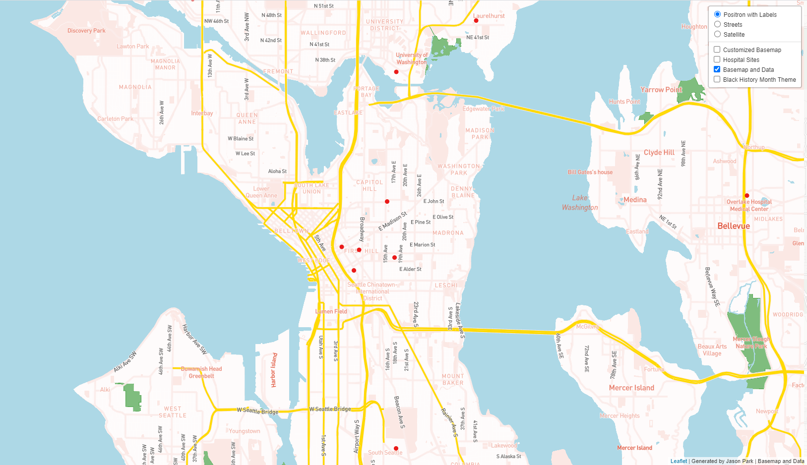

# Map Design and Tile Generation Deliverables

Link to hosted webmap: https://jasonp24.github.io/MapBox_Mapping/

## Tile 1 Screenshot - Customized Basemap:

<ul>
  <li>Description of tile: I modified the original basemap by making major roadways more visible by changing the color of major roads to yellow. However, I only changed the color    for major roadways so the color was not too distracting from the basemap. I also increased the visibility of land areas and water bodies to green and blue respectively as well.    Finally, I changed the font of streets to black to distinguish streets from cities in the greater Seattle region</li>
  <li>Geographic Area of Focus: Greater Seattle Region</li>
  <li>Zoom Levels: Max Zoom - 14; Min Zoom - 10</li>
</ul>
 

## Tile 2 Screenshot - Map Data (Hospital Site Locations, Seattle)

<ul>
  <li>Description of tile: Data layer showing the site locations for Hospitals focusing in and around downtown Seattle</li>
  <li>Geographic Area of Focus: Greater Seattle Region</li>
  <li>Zoom Levels: Max Zoom - 14; Min Zoom - 10</li> 
</ul>
 

## Tile 3 Screenshot - Basemap and Data

<ul>
  <li>Description of tile: Tile utilizing the customized basemap from Tile 1 and the map data from Tile 2 in one singular tile</li>
  <li>Geographic Area of Focus: Greater Seattle Region</li>
  <li>Zoom Levels: Max Zoom - 14; Min Zoom - 10</li>
</ul>
 

## Tile 4 Screenshot - Black History Month Theme

<ul>
  <li>Description of tile: Customized map tile made using the coloring scheme representative of Black History Month</li>
  <li>Geographic Area of Focus: Greater Seattle Region</li>
  <li>Zoom Levels: Max Zoom - 14; Min Zoom - 10</li>
</ul>

